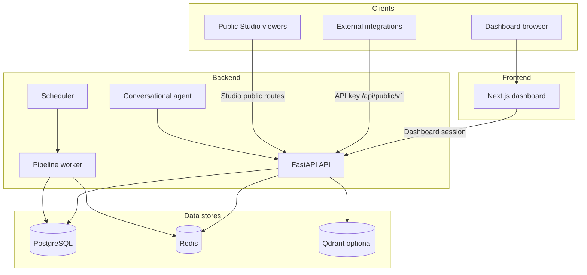

# Architecture overview

Pulse is split into a **dashboard**, a **REST API**, background **workers**, and an optional **conversational agent** service.

## Deployment models

| Model | Description |
|-------|-------------|
| **[Pulse Cloud](/docs/hosting/cloud)** | SaaS — Pulse operates the stack; customers sign in and connect their databases |
| **[Self-hosted](/docs/hosting/self-hosted)** | Customer operates the stack (Docker) inside their environment |

The same application components exist in both; only **who runs the servers** and **how Pro is billed** differ.

On **self-hosted**, the published **`pulseai/pulse`** Docker image bundles the dashboard, API, workers, agent, scheduler, and embedded Redis behind one nginx port. Postgres runs as a separate container (or external database). See [Self-hosted](/docs/hosting/self-hosted).

## System components

## Public API (integrations)

External systems integrate through the **Public API** at `/api/public/v1` using an `X-API-Key` header.

| Topic | Detail |
|-------|--------|
| **Authentication** | API keys with read or write scope |
| **Rate limits** | 30 req/min (read), 10 req/min (write) per key when Redis is enabled |
| **Documentation** | [API overview](/docs/api/overview) and OpenAPI ReDoc on your API host (`/api/public/redoc`) |

Dashboard sign-in uses a separate session mechanism. **API keys and dashboard sessions are not interchangeable.**

## Studio public access

Published Studio dashboards and embed links are available without an API key:

- `GET /api/public/v1/studio/dashboards/{slug}` — public dashboards
- `GET /api/public/v1/studio/embed/{token}` — embed links

See [Studio (public API)](/docs/api/studio).

## Related docs

- [Pulse Cloud (SaaS)](/docs/hosting/cloud)
- [Self-hosted](/docs/hosting/self-hosted)
- [Public API overview](/docs/api/overview)
