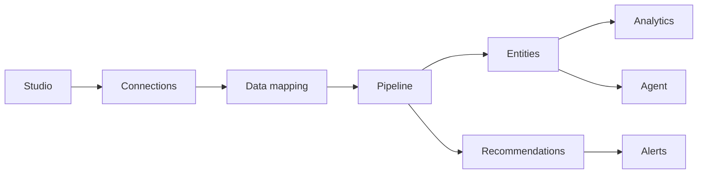

# Product features

Pulse is a dashboard-first intelligence platform. After you connect your data and run the pipeline, you explore entities, act on recommendations, build analytics in Studio, and automate alerts—all from the web app.

This guide describes **what each area does** and **where to find it** in the dashboard sidebar.

## How Pulse works

Most teams follow this path:

1. **Business context** — Describe your business so agents and recommendations stay relevant.
2. **Connections** — Add databases, warehouses, spreadsheets, or files.
3. **Data mapping** — Tell Pulse which table and columns represent your entities (SQL sources).
4. **Pipeline** — Profile entities, score risk, and generate recommendations on a schedule or on demand.
5. **Intelligence** — Review entities, recommendations, analytics, Studio, and the conversational agent.
6. **Operations** — Configure alerts and (on Pro) audit logs.

New accounts see a **setup banner** on the dashboard until business context, at least one connection, and schema mapping (when required) are complete.

---

## Overview

### Dashboard

**Sidebar:** Overview → **Dashboard**

Your home view for organization-wide risk: key metrics, risk distribution, trends, a preview of entities and recommendations, and pipeline status. Use it to monitor health at a glance before drilling into Intelligence or Data & pipeline.

---

## Intelligence

### Entities

**Sidebar:** Intelligence → **Entities**

Searchable directory of profiled entities with risk tiers (High, Medium, Low, Healthy). Filter by tier, paginate results, and open individual profiles to see scores and history. Entity counts and distribution also appear on the main dashboard.

### Recommendations

**Sidebar:** Intelligence → **Recommendations**

Actionable items produced by the pipeline—prioritized suggestions your team can act on or dismiss. Summary stats show active and critical counts. Completed or dismissed items feed into your notification history.

### Analytics

**Sidebar:** Intelligence → **Analytics**

Deeper views on risk over time: trend charts for 7, 30, or 90 days, segment breakdowns, and cohort analysis. Complements the dashboard overview when you need period comparisons or segment-level detail.

### Studio

**Sidebar:** Intelligence → **Studio**

Self-serve analytics on your connected data:

- **Saved queries** — Write SQL, run against a chosen connection, export results.
- **Visualizations** — Turn query results into charts (bar, line, pie, and others).
- **Dashboards** — Arrange visualizations on a grid; star, tag, and share internally.
- **Public sharing** — Publish dashboards by slug or embed token for viewers without a Pulse login.

Studio works with SQL databases, warehouses, and [file-based sources](/docs/data-sources#studio-and-file-based-connections) (CSV upload, Google Sheets, S3 CSV objects). For public URL formats, see [Studio (public API)](/docs/api/studio).

### Agent

**Sidebar:** Intelligence → **Agent**

Conversational assistant grounded in your organization’s data and business context. Start new threads, continue past conversations, and ask questions about entities, risk, and recommendations. Usage counts toward your plan’s monthly agent query limit.

---

## Data & pipeline

### Connections

**Sidebar:** Data & pipeline → **Connections**

Add and manage data sources: pick a connector type, enter credentials, test connectivity, and view status on each card. You can also use **Connect Data** in the top navigation for quick access.

See **[Supported data sources](/docs/data-sources)** for connector types, required fields, and which features each source supports.

### Data mapping

**Sidebar:** Data & pipeline → **Data mapping**

Required for SQL-capable connections before the pipeline can profile entities. The wizard walks through:

1. **Choose table** — Entity source table.
2. **Identity** — Entity ID and display name columns.
3. **Signals** — Columns used for risk scoring.
4. **Review** — Confirm and save.

Pulse can infer mappings from your schema where possible. File-only or document connectors may skip mapping; see [feature support by connector](/docs/data-sources#feature-support-by-connector-category).

### Pipeline

**Sidebar:** Data & pipeline → **Pipeline**

Runs the intelligence pipeline against your mapped data:

- **Run now** — Trigger an on-demand run.
- **Schedule** — Set or adjust cron-based presets for automatic runs.
- **History** — View past runs with status (queued, running, succeeded, failed) and duration.

Pipeline output powers Entities, Recommendations, Analytics, and notifications. Business context from Settings informs how agents interpret your domain.

---

## Operations

### Alerts

**Sidebar:** Operations → **Alerts**

Define rules on metrics such as risk score. When a rule fires, Pulse notifies through configured channels—including email-style delivery and **webhooks** you create under Settings. Attach webhook channels to specific alert rules.

### Audit logs

**Sidebar:** Operations → **Audit logs**

Searchable history of workspace activity (sign-ins, settings changes, API key actions, and more). Available on **Pro** (Pulse Cloud) or with a valid **Pro-equivalent license** (self-hosted). Free plans see an upgrade prompt.

---

## Workspace

### Notifications

**Sidebar:** Workspace → **Notifications** · **Bell icon** in the header

Inbox for pipeline completions, new recommendations, alert triggers, and other events. The bell shows recent items; open the full page to review and manage notification history.

### Usage

**Sidebar:** Workspace → **Usage**

Meters for connections, pipeline runs, agent queries, Studio dashboards, API keys, webhooks, and team size—compared to your plan limits. Use this page before hitting caps or when planning an upgrade.

### Plan & billing

**Sidebar:** Workspace → **Plan & billing**

Current plan, entitlements, and upgrade path (Pulse Cloud). Self-hosted operators manage licenses under Settings instead.

### Team & roles

**Sidebar:** Workspace → **Team & roles**

Invite teammates and assign roles:

| Role | Typical use |
|------|-------------|
| `admin` | Full workspace control, billing, team |
| `manager` | Connections, pipeline, alerts, Studio |
| `analyst` | Intelligence views, Studio, limited admin |
| `viewer` | Read-only access to dashboards and intelligence |

### Settings

**Sidebar:** Workspace → **Settings**

Organization and account configuration:

- **Organization** — Name, logo, and **business context** (used by the pipeline and agent).
- **Account** — Your profile and password.
- **API keys** — Create read or write keys for the [Public API](/docs/api/overview). Also available at `/dashboard/api-keys`.
- **Webhooks** — Outbound endpoints for alert delivery.
- **LLM keys** — Self-hosted only: bring your own model provider (e.g. Ollama).
- **License** — Self-hosted only: activate or view license status.

---

## Developer

### Playground

**Sidebar:** Developer → **Playground**

Send live requests to the Public API using keys from Settings. Useful for testing entities, recommendations, pipeline triggers, and other endpoints before wiring your own integration.

### Documentation

**Sidebar:** Developer → **Documentation**

Opens this docs site (`/docs`).

### Public API

External systems use `/api/public/v1` with an `X-API-Key` header. Dashboard sign-in sessions do **not** work on the public API.

| Resource | Guide |
|----------|--------|
| Overview | [Public API overview](/docs/api/overview) |
| Entities | [Entities API](/docs/api/entities) |
| Recommendations | [Recommendations API](/docs/api/recommendations) |
| Analytics | [Analytics API](/docs/api/analytics) |
| Pipeline | [Pipeline API](/docs/api/pipeline) |
| Studio (public) | [Studio API](/docs/api/studio) |

---

## Plan limits

Free includes core intelligence; Pro removes most quotas and unlocks audit logs. Limits below match the dashboard plan catalog; see **Plan & billing** or [Pricing](/pricing) for current pricing.

| Limit | Free | Pro |
|-------|------|-----|
| Data connections | 3 | Unlimited |
| API keys | 1 | Unlimited |
| Webhook channels | 1 | Unlimited |
| Team members | 3 | Unlimited |
| Pipeline runs / month | 20 | Unlimited |
| Agent queries / month | 100 | Unlimited |
| Studio dashboards | 5 | Unlimited |
| Studio query runs / day | 600 | Unlimited |
| Audit logs | — | Included |

**Self-hosted:** A valid license provides Pro-equivalent quotas and audit logs without a cloud subscription. See [Self-hosted](/docs/hosting/self-hosted) and [License activation](/docs/configuration/license).

---

## Related docs

- [Getting started](/docs/getting-started) — Signup and first connection
- [Supported data sources](/docs/data-sources) — Connectors and credentials
- [Architecture](/docs/architecture) — Technical components and deployment
- [Pulse Cloud](/docs/hosting/cloud) — SaaS operations
- [Public API overview](/docs/api/overview) — Integrations
