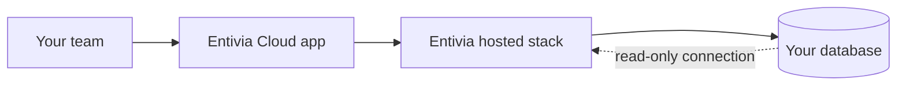

# Entivia Cloud

**Entivia Cloud** is our hosted SaaS product. Your business signs up, works inside the Entivia environment we operate, and connects **your** database—without installing or maintaining servers yourself.

We run the platform; you bring your [data connection](/docs/data-sources) and your team.

## Who this is for

- Teams that want intelligence and recommendations **without** running Docker or managing Postgres/Redis
- Businesses that prefer subscription billing and automatic updates
- Faster evaluation: create an account and connect data in minutes

If you need Entivia entirely inside your own network, use [Self-hosted](/docs/hosting/self-hosted) instead.

## How it works

1. **You** use the dashboard at our public URL (`app.entivia.online`).
2. **We** host the API, workers, agents, scheduler, and operational data stores.
3. **Your database** stays where it is; Entivia connects with credentials you provide (read-only recommended).

Entivia does not require you to ship a copy of your customer data to us for basic pipeline operation—the platform queries your live schema according to your connection settings and plan.

## Get started on Entivia Cloud

### 1. Create an organization

1. Go to [Sign up](/auth/signup).
2. Verify your email if prompted.
3. Add business context and your first connection from the dashboard setup banner.

### 2. Connect your data

1. Open **Data & pipeline → Connections** (or **Connect Data** in the header).
2. Add a **read-only** [data source](/docs/data-sources) (PostgreSQL, MySQL, Snowflake, S3, and others).
3. Complete **Data mapping** for SQL sources, then test the connection and run the pipeline from **Data & pipeline → Pipeline** (or wait for the scheduled run).

### 3. Invite your team

Admins can invite users with roles (`admin`, `manager`, `analyst`, `viewer`) under **Team**.

### 4. Upgrade when you need more

- View usage under **Usage**.
- Upgrade to Pro from [Pricing](/pricing) or **Plan & billing** in the dashboard.
- Pro unlocks higher limits, advanced analytics, Studio features, and more—see your plan page for current entitlements.

## What you do not manage on Entivia Cloud

As a Cloud customer you typically **do not**:

- Set `JWT_SECRET`, `DATABASE_URL`, or other API environment variables
- Deploy Docker images or run `docker compose`
- Purchase or activate a self-hosted license key

Those are operated by Entivia. Configuration you **do** control: connections, API keys, webhooks, Studio content, and team settings.

## Integrations on Cloud

- **Public API** — Create keys under **Settings → API keys**; same `/api/public/v1` surface as self-hosted. See [API overview](/docs/api/overview).
- **Playground** — Try endpoints at **Developer → Playground** after sign-in.

See **[Product features](/docs/features)** for a full tour of the dashboard.

## Entivia Cloud vs self-hosted

| Topic | Entivia Cloud | Self-hosted |
|-------|-------------|-------------|
| Hosting | Entivia | You |
| Pro billing | Subscription via dashboard | License key |
| License settings in UI | No | Yes |
| LLM keys in Settings | Uses platform defaults | You can bring your own (e.g. Ollama) |

## Related

- [Getting started](/docs/getting-started)
- [Product features](/docs/features)
- [Self-hosted](/docs/hosting/self-hosted)
- [Public API overview](/docs/api/overview)
