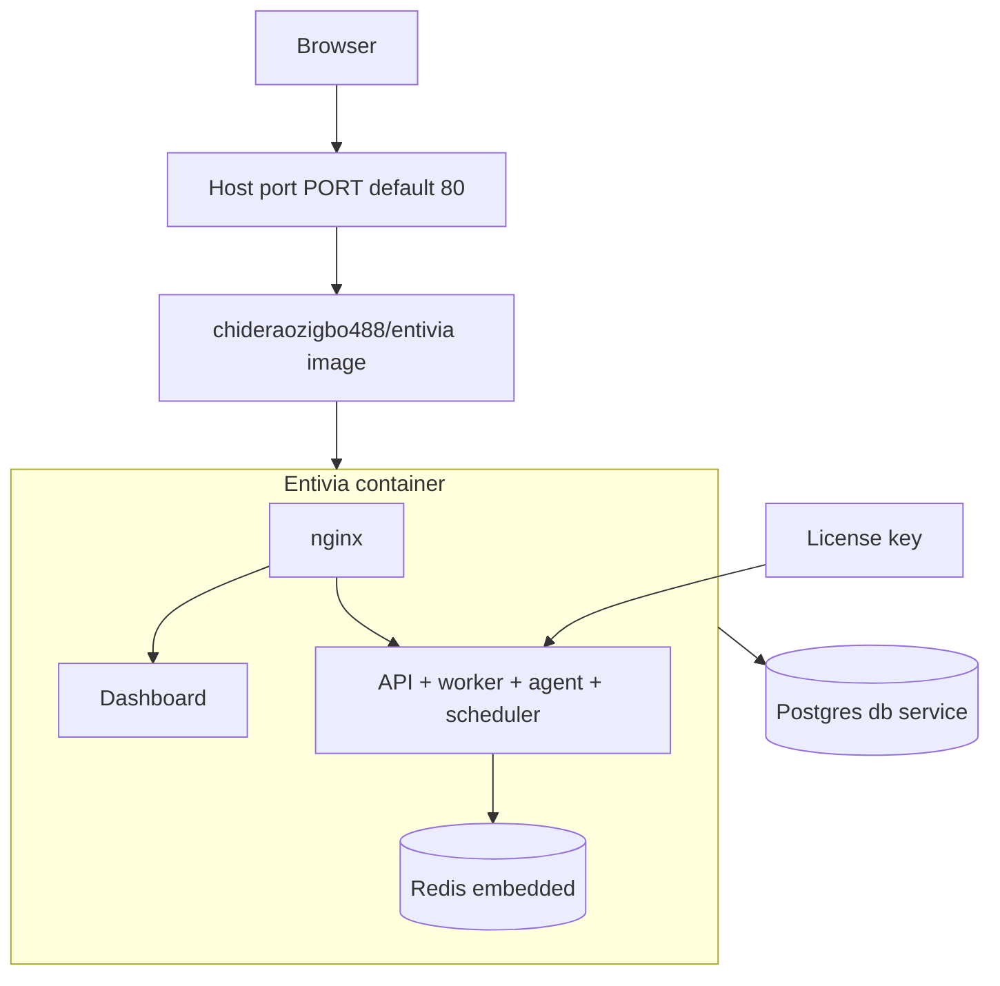

# Self-hosted

**Self-hosted** Entivia runs on **your** infrastructure (VPC, on-prem, private cloud). You do not need the Entivia source code—the published **`chideraozigbo488/entivia`** image on [Docker Hub](https://hub.docker.com/r/chideraozigbo488/entivia) includes everything in one container.

## What you get

| Component | Included in `chideraozigbo488/entivia` |
|-----------|----------------------------|
| Dashboard (Next.js) | Yes — served by nginx |
| API (FastAPI) | Yes |
| Pipeline worker & scheduler | Yes |
| Conversational agent | Yes |
| Redis | Yes — embedded in the image |
| Postgres | **No** — separate `db` service in compose (or your own database) |

Nginx listens on a **single port** (default **80**) and routes browser traffic to the dashboard and `/api` to the backend. You do not deploy a separate frontend image.

> Entivia application source is private. Self-hosters pull the pre-built image from Docker Hub and configure it with `.env` plus the compose file below.

## Entivia Cloud vs self-hosted

| | Entivia Cloud (SaaS) | Self-hosted |
|---|-------------------|-------------|
| Operated by | Entivia | You |
| Sign up at | Our hosted app | Your server after `docker compose up` |
| Pro access | [Subscription](/pricing) | [License key](/pricing/self-hosted) |
| Docker | Not required | `chideraozigbo488/entivia` + Postgres |

## Prerequisites

- Docker Engine 24+ and Docker Compose v2
- A machine with at least **4 GB RAM** (8 GB recommended for production)
- Outbound internet for LLM APIs (unless you use [Ollama](/docs/configuration/redis-email-storage) locally)
- A [license key](/docs/configuration/license) for Pro features (optional; free tier works without one)

## Quick start

### 1. Create a deployment directory

On your server, create a folder for Entivia (for example `~/entivia`) and add two files: `docker-compose.yml` and `.env`.

### 2. `docker-compose.yml`

Save this as `docker-compose.yml` (matches the recommended self-hosted layout):

```yaml
services:

  db:
    image: postgres:16-alpine
    environment:
      POSTGRES_USER: entivia
      POSTGRES_PASSWORD: ${POSTGRES_PASSWORD:?missing — set POSTGRES_PASSWORD in .env}
      POSTGRES_DB: entivia
    volumes:
      - db_data:/var/lib/postgresql/data
    restart: unless-stopped
    healthcheck:
      test: ["CMD-SHELL", "pg_isready -U entivia -d entivia"]
      interval: 10s
      timeout: 5s
      retries: 5
      start_period: 10s

  qdrant:
    image: qdrant/qdrant:latest
    volumes:
      - qdrant_data:/qdrant/storage
    restart: unless-stopped
    healthcheck:
      test: ["CMD-SHELL", "bash -c '</dev/tcp/127.0.0.1/6333'"]
      interval: 10s
      timeout: 5s
      retries: 5
      start_period: 10s

  entivia:
    image: chideraozigbo488/entivia:${ENTIVIA_VERSION:-latest}
    env_file:
      - path: .env
        required: false
    ports:
      - "${PORT:-80}:80"
    environment:
      DATABASE_URL: postgresql+asyncpg://entivia:${POSTGRES_PASSWORD}@db:5432/entivia
      DATABASE_SSLMODE: disable
      QDRANT_URL: http://qdrant:6333
      REDIS_URL: redis://127.0.0.1:6379/0
      LOCAL_STORAGE_PATH: /app/uploads
      HOME: /home/entivia
      FRONTEND_URL: ${FRONTEND_URL:-http://localhost}
    volumes:
      - entivia_data:/data
      - uploads_data:/app/uploads
      - entivia_logs:/var/log/entivia/streams
    depends_on:
      db:
        condition: service_healthy
      qdrant:
        condition: service_healthy
    restart: unless-stopped
    healthcheck:
      test: ["CMD", "curl", "-f", "http://localhost/health"]
      interval: 30s
      timeout: 10s
      retries: 3
      start_period: 90s

volumes:
  db_data:
  qdrant_data:
  entivia_data:
  entivia_logs:
  uploads_data:

```

### 3. `.env` — required variables

Create `.env` in the same directory. At minimum set:

```bash
# Database (used by the db service and entivia service)
POSTGRES_PASSWORD=          # openssl rand -hex 24

# Security
JWT_SECRET=                 # openssl rand -hex 32
ENCRYPTION_KEY=             # python -c "from cryptography.fernet import Fernet; print(Fernet.generate_key().decode())"

# LLM (at least one)
ANTHROPIC_API_KEY=
GROQ_API_KEY=

# URL users open in the browser (no trailing slash)
FRONTEND_URL=http://localhost

# Optional: pin image tag (default latest)
ENTIVIA_VERSION=latest

# Optional: host port (default 80)
PORT=80
```

See [Environment variables](/docs/configuration/environment-variables) for the full self-hosted reference (email, Redis tuning, storage, license, and more).

### 4. Start Entivia

```bash
docker compose pull
docker compose up -d
```

Open the URL you set in `FRONTEND_URL` (for example `http://localhost` when using port 80).

Check health:

```bash
curl http://localhost/health
```

### 5. First login

1. Sign up an admin account at your `FRONTEND_URL`.
2. Add a [data source](/docs/data-sources) under **Settings → Connections**.
3. Add business context, connect your data source, and run your first pipeline.

## Architecture



## Volumes

| Volume | Purpose |
|--------|---------|
| `db_data` | Postgres data |
| `entivia_data` | Embedded Redis persistence |
| `uploads_data` | Avatars, logos, CSV uploads (`STORAGE_BACKEND=local`) |

## Upgrades

Pull the latest image and recreate containers:

```bash
docker compose pull
docker compose up -d
```

Pin a specific version with `ENTIVIA_VERSION=1.2.3` in `.env` before upgrading.

## Pro license

1. Purchase at [Self-hosted pricing](/pricing/self-hosted).
2. Activate under **Settings → License** in the dashboard.

Details: [License activation](/docs/configuration/license).

## External Postgres

To use managed Postgres instead of the bundled `db` service:

1. Set `DATABASE_URL` in `.env` to your external DSN.
2. Remove the `db` service and `depends_on` from `docker-compose.yml`.
3. Ensure the `entivia` service still receives `DATABASE_URL` (via `.env` only).

## Data privacy

- Use `AI_PROVIDER=ollama` with a local Ollama instance so Studio AI never calls external LLMs.
- Connect customer databases with **read-only** credentials.
- Set `FRONTEND_URL` to the exact URL users type in the browser (required for CORS and email links).

## Related

- [Environment variables](/docs/configuration/environment-variables)
- [Redis, email & storage](/docs/configuration/redis-email-storage)
- [Entivia Cloud](/docs/hosting/cloud)
